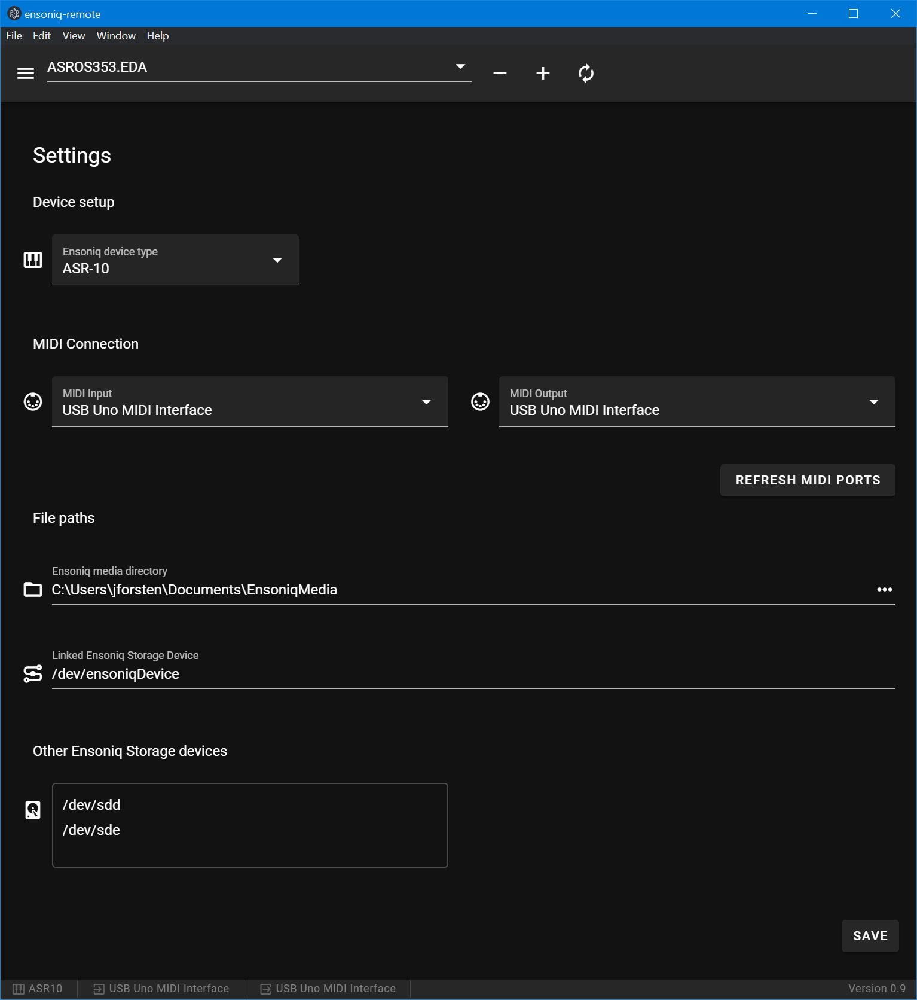

# ensoniq-remote

> An electron-vue project for remote sample upload to Ensoniq samplers


Things to configue in setup view:
- **Ensoniq media directory:** dir location for ensoniq images (*iso, *.img)
- **Working directory:** temporary dir where EpsLin will extract EFEs
- **Ensoniq Storage Device:** Shared storate between Ensoniq and PC (like SCSI2SD v6 drive)
- **Path to EpsLin executable:** Runnable EpsLin location

### Example:



**Note 1: EpsLin used should be the latest one (i.e. which has support for JSON output). See** https://gitlab.com/jforsten/EpsLin
**Note 2: To access raw devices (like SCSI2SD as USB drive) in development, you need to run the Cmd shell as Admin (i.e. where you use the 'npm run dev')**

#### Build Setup

``` bash
# install dependencies
npm install

# serve with hot reload at localhost:9080
npm run dev

# build electron application for production
npm run build


# lint all JS/Vue component files in `src/`
npm run lint

```

---

This project was generated with [electron-vue](https://github.com/SimulatedGREG/electron-vue)@[8fae476](https://github.com/SimulatedGREG/electron-vue/tree/8fae4763e9d225d3691b627e83b9e09b56f6c935) using [vue-cli](https://github.com/vuejs/vue-cli). Documentation about the original structure can be found [here](https://simulatedgreg.gitbooks.io/electron-vue/content/index.html).
